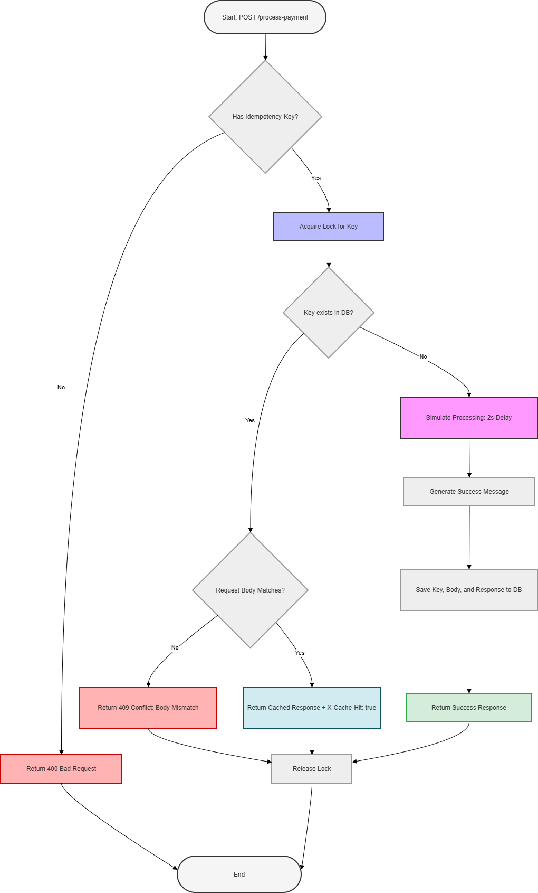

#  Idempotency-Gateway (The "Pay-Once" Protocol)

### **Overview**
This project implements a robust **Idempotency Layer** for FinSafe Transactions Ltd. to prevent double charging customers due to network retries or race conditions. This solution ensures that no matter how many times a client retries a payment request, the transaction is processed **exactly once**.

---

### **1. Architecture Diagram(Flowchart)**



*The diagram above illustrates the request validation, the in-flight locking mechanism, the idempotency check against the database, and the final payment processing flow.*

---

### **2. Setup Instructions**

**Prerequisites:**
*   **Java 21** or higher
*   **Maven** (for building and running)
*   **PostgreSQL** (running locally or in a container)

**Steps:**
1.  **Database Setup:** Create a PostgreSQL database named `idempotency_db`.
2.  **Configuration:** Update `src/main/resources/application.properties` with your database username and password.
3.  **Run Application:** Navigate to the project root and run:
    ```bash
    mvn spring-boot:run
    ```
4.  **Test:** Use Postman or cURL to send requests to `http://localhost:8080/process-payment`.

---

### **3. API Documentation**

**Endpoint:** `POST /process-payment`

**Required Headers:**
*   `Idempotency-Key`: A unique string identifying the specific transaction.

**Request Body Example:**
```json
{
    "amount": 5000.0,
    "currency": "RWF"
}
```

**Response Behavior:**
*   **Success (New):** Returns `200 OK` with "Charged...". Processes in 2 seconds.
*   **Success (Duplicate):** Returns `200 OK` instantly with header `X-Cache-Hit: true`.
*   **Error (Missing Key):** Returns `400 Bad Request`.
*   **Error (Body Mismatch):** Returns `409 Conflict` if the same key is used for a different amount/currency.

---

### **4. Design Decisions**

*   **Thread-Safe Locking:** To handle **"In-Flight"** race conditions, I implemented a custom locking mechanism using `ConcurrentHashMap`. This ensures that even if multiple identical requests arrive at the exact same millisecond, the payment logic only executes once while others wait.
*   **Clean Architecture:** The project follows the Controller-Service-Repository pattern, ensuring that business logic is decoupled from HTTP handling and database persistence.
*   **Professional Styling:** Used constructor-based dependency injection and clean, human-readable code structures to ensure the project is maintainable and scalable.

---

### **5. Developer's Choice (Extra Feature)**

**Feature: Security Fingerprinting (Device Mismatch Protection)**

*   **Problem:** If an attacker steals a valid `Idempotency-Key` and the request body, they could potentially replay the request from a different device to gain access to sensitive transaction results.
*   **Solution:** I implemented **Security Fingerprinting**. On the first request, the system captures and stores the **User-Agent** (the device's unique signature). If any subsequent request uses the same key but comes from a different device or browser, the system blocks it with a `403 Forbidden` security alert.
*   **Value:** This adds a crucial layer of defense against **Session Hijacking** and **Replay Attacks**, ensuring that idempotency is only granted to the original, authorized requester.

---

### **6. Technologies Used**
*   **Spring Boot**: Framework for the REST API.
*   **Spring Data JPA**: For database abstraction.
*   **PostgreSQL**: For persistent storage.
*   **Lombok**: To reduce boilerplate code.
*   **Mermaid**: Used for designing the architecture flowchart.
